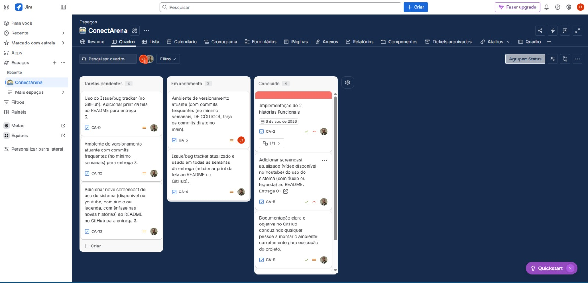

# ConectArena
## 1. Descrição do Projeto
Este projeto consiste em uma plataforma de gerenciamento de eventos na arena de Pernambuco, compra de ingressos, divulgação de eventos, entre outros.
## 2. Cargos do Grupo
A equipe do projeto é composta pelos seguintes membros e suas respectivas funções:

- **Davi Lucas** - Desenvolvedor
- **Hugo Mendonça** - Scrum Master
- **Michel Serpa** - Desenvolvedor
- **Luiz Fernando** - Desenvolvedor
- **Lucas Vinicius** - Desenvolvedor
-  **Thainá Pontes** - Desenvolvedor(a)
- **Ana Beatriz** - Desenvolvedor(a)
  
## 3. Entregas:
### Entrega 1 (16/03)
#### Histórias de Usuário:
https://docs.google.com/document/d/1Ee_YiTXSb7gR4tZWZ2L_q5IiD5HeJT4acSrWK4zyS3Y/edit?tab=t.0

#### Figma:
[https://www.figma.com/make/xeGbgU9OQFCPYm1BkJyt0o/Plataforma-de-Ingressos?p=f&t=cMalvMEQ03wqK9hJ-0&preview-route=%2Fperfil](https://snuff-skier-30453070.figma.site/)

#### Screencast Figma:

### Entrega 2 (06/04)

### Screenshot do Jira:

### Screenshot de duas histórias do usuário:

### Entrega 3 (27/04)

### Issue/bug tracker atualizado dadas as histórias adicionadas e verificação de outras funções.

### Sreencast Figma:

https://youtu.be/vfWygV72uX0?si=84m4L5fOT6NgdDML

### Entrega 4 (18/05)

Screencast: https://youtu.be/6cm3xAS81DU

## - Issues atuais:
  1.1 - Ao criar um evento, o ADM é o único que consegue visualizá-lo. Caso outra pessoa utilize a aplicação, não há uma atualização de eventos criados, reiniciando a aplicação do zero.
  

  1.2 - Na aba "Comunidade" ao realizar um comentário em alguma postagem, o mesmo não é exibido abaixo do post do usuário. A mensagem é enviada, mas não é exibida.
  

  1.3 - Ao favoritar um evento, o mesmo não é exibido no perfil do usuário na parte, contabilizada, dos eventos favoritos.
  

## 4. Como rodar a Conectarena em seu equipamento:

Guia Rápido 

Backend: JDK 17 (o projeto usa Java 17), Maven wrapper incluído (mvnw / mvnw.cmd).
Frontend: Node.js (recomendo Node 18+), pnpm (ou npm), Vite.
Git para clonar o repositório.
Portas: backend em 8080, frontend Vite em 5173 (padrões do projeto).

1) Clonar o repositório

No terminal de seua aplicação, faça:

Substitua <REPO_URL> pelo URL real.
Windows (PowerShell) / Linux (bash):

- git clone <REPO_URL> conectarena
- cd conectarena

2) Instalar pré-requisitos

Windows (uso recomendado: Winget/Chocolatey / instaladores oficiais)
Git (via winget):
- winget install --id Git.Git -e

JDK 17 (Eclipse Temurin):
- winget install --id EclipseAdoptium.Temurin.17 -e

Node.js 18+
- winget install --id OpenJS.NodeJS.18 -e

pnpm (global) — opcional (pode usar npm):
- npm install -g pnpm

Linux (Debian/Ubuntu exemplo)
Atualizar e instalar ferramentas:
- sudo apt update
- sudo apt install -y git curl unzip

OpenJDK 17
- sudo apt install -y openjdk-17-jdk

Node 18+ (NodeSource) e pnpm:
- curl -fsSL https://deb.nodesource.com/setup_18.x | sudo -E bash -
- sudo apt install -y nodejs
- sudo npm install -g pnpm

Fedora/CentOS use o gerenciador de pacotes equivalente (dnf/yum) ou instaladores oficiais.

Verifique instalações:

- git --version
- java -version (deve indicar 17)
- node -v
- pnpm -v (se instalou)
Se preferir não instalar pnpm globalmente, o npm também funciona para instalar dependências (npm install em vez de pnpm install).

3) Backend — Configurar e rodar

Entrar na pasta do backend:
- cd backend/plataforma

Permissão no Linux (se necessário):
- chmod +x mvnw

Rodar com o Maven Wrapper (usa o mvnw do projeto — não precisa instalar Maven):
Windows (PowerShell):

- .\mvnw.cmd -DskipTests spring-boot:run

Linux (bash):
- ./mvnw -DskipTests spring-boot:run

Observações:
Por padrão o backend usa server.port=8080 e H2 (arquivo ./conectarena-db), conforme src/main/resources/application.properties.
Se for desejar rodar o jar empacotado:
- ./mvnw -DskipTests package
- java -jar target/*.jar

4) Frontend — Configurar e rodar

Entrar na pasta do frontend (figma):
- cd frontend/figma

Instalar dependências:
- npm install

Rodar em modo desenvolvimento (Vite):
- npm run dev

Por padrão o Vite roda em http://localhost:5173. Abra esse endereço no navegador.

5) Acessar a aplicação

Frontend: http://localhost:5173
Backend (API): http://localhost:8080
O frontend faz requisições ao backend; ao abrir a UI verifique no console do navegador e na saída do terminal do backend por mensagens/erros.

6) Build para produção (opcional)

Backend empacotado:
- cd backend/plataforma
- ./mvnw -DskipTests package
# executar jar
- java -jar target/plataforma-0.0.1-SNAPSHOT.jar

Frontend build e servir estático:
- cd frontend/figma
- pnpm build
# Os arquivos ficam em dist/. Use um servidor estático para testar:
- npm install -g serve
- serve -s dist -l 5000
# abre em http://localhost:5000

7) Variáveis/Configurações (quando necessário)

O application.properties atual contém a configuração H2 e porta. Se quiser usar outro DB ou configurar JWT secrets, adapte src/main/resources/application.properties ou use variáveis de ambiente conforme implementação do backend.
Se o frontend fizer chamadas a outro host, ajuste base URL no arquivo api.ts (se houver configuração).
8) Erros comuns e soluções rápidas

Erro: permission denied: ./mvnw (Linux) — execute chmod +x mvnw.
Erro: port already in use — verifique processos usando lsof -i :8080 (Linux/mac) ou netstat -ano | findstr 8080 (Windows) e mate o processo.
Erro: pnpm install falha por falta de Node ou versão incompatível — confira node -v e atualize para Node 18+.
Erro 403 nas requisições ao backend — verifique se o backend está rodando e se o frontend está chamando a URL correta (http://localhost:8080/api/...). Conferir logs do backend para mensagens de segurança (Spring Security).
Se o frontend exibir erro de module/icone faltando após edição, execute pnpm install e reinicie pnpm dev.
9) Recomendações finais

Use o Maven wrapper (mvnw) para garantir compatibilidade de versão do Maven.
Para um ambiente mais previsível, use versões LTS: Java 17 e Node 18/20.
Para compartilhar o app com outros na rede local, verifique políticas de CORS no backend ou configure server.address se necessário.

